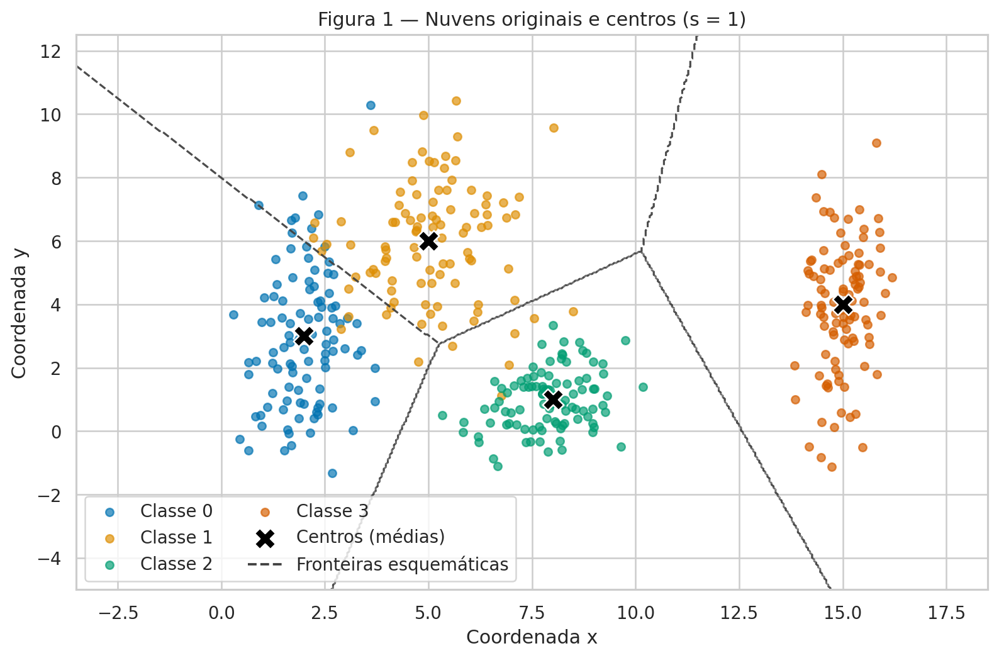
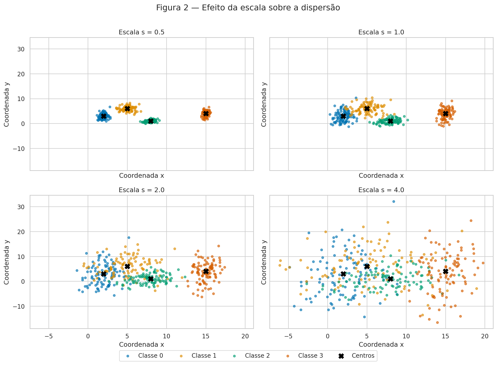
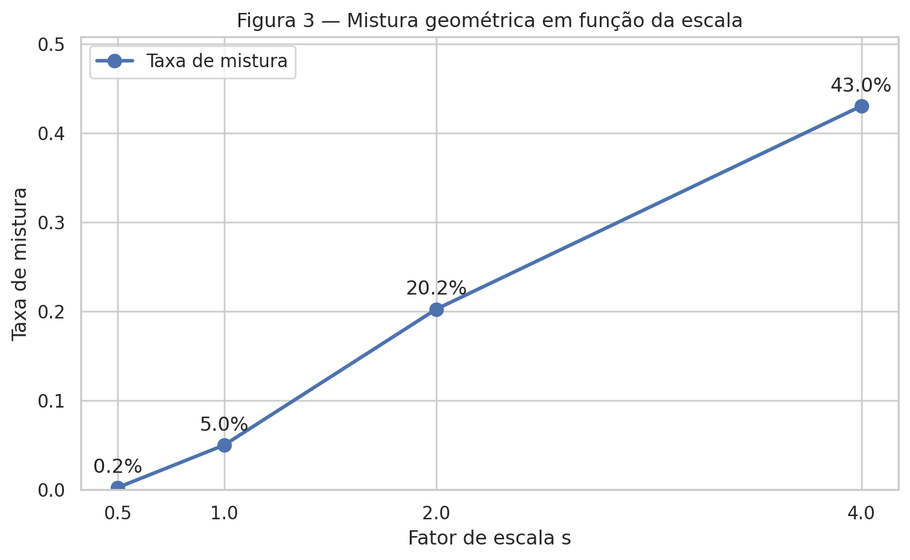
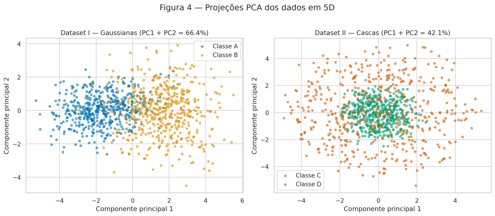
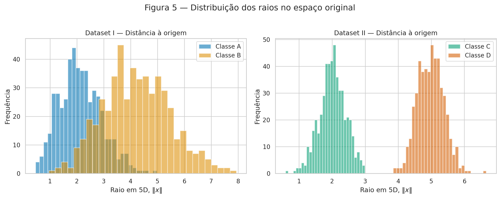
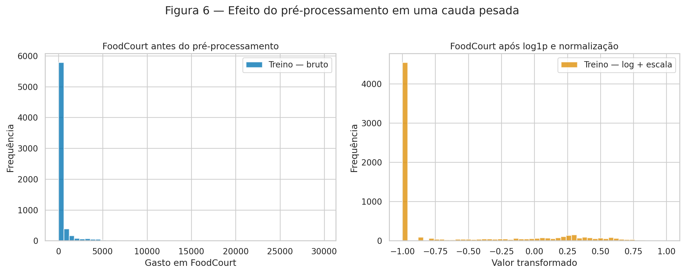

# Atividade — Preparação e análise de dados

**Aluno:** Gabriel Gerner Maggion<br>
**Disciplina:** Artificial Neural Networks and Deep Learning — Insper, 2026.2

O objetivo deste relatório é investigar como a dispersão e a geometria dos
dados afetam um problema de classificação e, em seguida, preparar um conjunto
real para uma rede neural com ativação `tanh`. Todo o código foi executado com
semente fixa. Na parte sintética, foi usado apenas um gerador:
`rng = np.random.default_rng(42)`.

## Exercise 1

### A — Generate the clouds

Foram geradas 400 observações, 100 por classe, a partir de distribuições
Gaussianas bidimensionais independentes. As médias e os desvios-padrão usados
foram exatamente os fornecidos no enunciado.

| Classe | Média | Desvio-padrão |
|---:|:---:|:---:|
| 0 | $[2, 3]$ | $[0.8, 2.5]$ |
| 1 | $[5, 6]$ | $[1.2, 1.9]$ |
| 2 | $[8, 1]$ | $[0.9, 0.9]$ |
| 3 | $[15, 4]$ | $[0.5, 2.0]$ |



**Figura 1.** Nuvens em $s=1$, com os centros verdadeiros marcados por `X`.
As linhas tracejadas são um esboço das regiões de centro mais próximo. Elas
não são o resultado de um modelo treinado.

### B — More or less spread out

Para isolar o efeito da escala, sorteei uma única matriz de ruídos Gaussianos
padronizados e construí cada observação como

$$
x_{k,n}(s) = \mu_k + s\,\sigma_k \odot z_{k,n}.
$$

Assim, as médias e as realizações padronizadas são mantidas, e somente a
dispersão muda entre os quatro conjuntos.



**Figura 2.** As quatro escalas usam os mesmos limites nos eixos. Em $s=0.5$
as nuvens são compactas; em $s=2$ a sobreposição já é forte; em $s=4$ as
classes ocupam extensas regiões em comum.

A razão de separação foi calculada por

$$
r_{ij}=\frac{\lVert\mu_i-\mu_j\rVert}
{\bar\sigma_i+\bar\sigma_j},
\qquad
\bar\sigma_k=\frac{\sigma_{k,x}+\sigma_{k,y}}{2}.
$$

| Par | $r_{ij}$ em $s=1$ |
|:---:|---:|
| (0, 1) | 1.326 |
| (0, 2) | 2.480 |
| (0, 3) | 4.496 |
| (1, 2) | 2.380 |
| (1, 3) | 3.642 |
| (2, 3) | 3.542 |

O menor valor é **1.326 para o par (0, 1)**, coerente com a sobreposição azul
e amarela da Figura 1. Como a razão varia com $1/s$, em $s=2$ esse menor valor
cai para **0.663**, sem necessidade de gerar novas observações.

A taxa de mistura é a fração dos pontos cujo centro mais próximo não é o
centro de sua própria classe. Os valores obtidos foram:

| Escala $s$ | Pontos misturados | Taxa de mistura |
|---:|---:|---:|
| 0.5 | 1 de 400 | 0.25% |
| 1.0 | 20 de 400 | 5.00% |
| 2.0 | 81 de 400 | 20.25% |
| 4.0 | 172 de 400 | 43.00% |



**Figura 3.** A mistura cresce rapidamente com a dispersão. Considerando uma
separação linear visualmente útil, a quebra fica clara **a partir de $s=2$**:
mais de um quinto das amostras está mais perto do centro errado e o menor
$r_{ij}$ já é $0.663<1$. Em sentido matemático estrito, Gaussianas têm suporte
ilimitado e nem mesmo uma escala pequena garante separação perfeita; aqui a
conclusão se refere à amostra finita e à geometria observada.

### C — Analysis

Em $s=1$, as classes 0 e 1 se sobrepõem, enquanto a classe 3 permanece bem
afastada e a classe 2 é a mais compacta. **Uma única reta não pode separar
quatro classes.** Um conjunto de fronteiras lineares consegue criar regiões
multiclasse aproximadas, como no esboço da Figura 1, mas não alcança separação
perfeita: a taxa de mistura de 5.00% confirma que há pontos em regiões
ambíguas.

As fronteiras tracejadas da Figura 1 correspondem a uma hipótese simples de
centro mais próximo. Uma rede poderia aprender fronteiras por partes e ajustar
curvas locais devido aos diferentes desvios das classes. Quando $s$ cresce, a
faixa na qual as distribuições coexistem também cresce. Nessa faixa, amostras
com entradas parecidas podem ter rótulos diferentes; portanto, aumenta a
região em que até uma fronteira mais flexível necessariamente comete erros.

## Exercise 2

### A — Dataset I: shifted Gaussians

Gerei 500 observações para cada classe em cinco dimensões usando as médias e
matrizes de covariância do enunciado. A Classe A é centrada na origem e a
Classe B tem centro teórico $[1.5,1.5,1.5,1.5,1.5]$. As covariâncias diferentes
produzem orientações e dispersões diferentes, incluindo correlação positiva
entre as duas primeiras variáveis na Classe A e negativa na Classe B.

### B — Dataset II: concentric shells

Para cada observação, sorteei $v\sim\mathcal N(0,I_5)$ e normalizei
$u=v/\lVert v\rVert$. Depois, multipliquei a direção pelo raio sorteado:
$\rho\sim\mathcal N(2,0.4)$ para a Classe C e
$\rho\sim\mathcal N(5,0.4)$ para a Classe D. Isso produz um núcleo e uma casca
concêntricos em cinco dimensões, com 500 pontos por classe.

### C — Visualize and compare



**Figura 4.** No Dataset I, PC1 + PC2 explicam **66.44%** da variância. No
Dataset II, explicam apenas **42.15%**. A projeção do Dataset I preserva melhor
a informação relevante à classificação: o deslocamento entre os centros
continua visível. No Dataset II, a projeção sugere núcleo e anel, mas perde três
componentes que também fazem parte do raio original.

As distâncias empíricas entre os centros, calculadas no espaço 5D antes do
PCA, são:

| Conjunto | Distância entre os centros |
|:---|---:|
| Dataset I — Gaussianas deslocadas | 3.3559 |
| Dataset II — Cascas concêntricas | 0.2614 |

No Dataset I, o valor é muito próximo da distância teórica
$\sqrt{5(1.5)^2}=3.3541$. No Dataset II, a pequena distância residual vem da
amostragem finita; teoricamente, ambos os centros estão na origem.



**Figura 5.** No Dataset I há sobreposição substancial das distâncias à
origem. No Dataset II, apesar de os centros quase coincidirem, os raios se
concentram perto de 2 e 5 e ficam claramente separados.

### D — Analysis

A combinação de centros coincidentes com raios separados mostra que a
informação discriminante do Dataset II é **radial**, não direcional. Um
hiperplano divide o espaço em dois semiespaços, mas não consegue envolver o
núcleo com uma classe e deixar a casca inteira do lado oposto. Como a casca
circunda o núcleo em todas as direções, qualquer hiperplano que atravesse a
região contém pontos das duas classes em seus lados. Mais dados apenas tornam
essa estrutura mais evidente; não a torna linearmente separável.

Uma projeção PCA aparentemente misturada **não prova** inseparabilidade no
espaço original: PCA é linear, otimiza variância total e descarta três das
cinco dimensões, sem usar os rótulos. Para este conjunto, uma função não linear
simples resolve a geometria:

$$
g(x)=\sum_{i=1}^{5}x_i^2-12.25.
$$

Podemos classificar como D quando $g(x)>0$ e como C quando $g(x)\le 0$. O
limiar $12.25=3.5^2$ fica entre os raios médios 2 e 5. A superfície de decisão
é uma hiperesfera, e não um hiperplano.

## Exercise 3

### A — Get to know the data

O [Spaceship Titanic](https://www.kaggle.com/competitions/spaceship-titanic/data)
é um problema de classificação binária. A coluna `Transported` indica se o
passageiro foi transportado para outra dimensão após a colisão da nave com uma
anomalia espaço-temporal. O arquivo possui 8.693 linhas: **4.378 positivas
(50.36%)** e **4.315 negativas (49.64%)**, portanto o alvo é praticamente
balanceado.

As variáveis foram separadas assim:

- **Numéricas:** `Age`, `RoomService`, `FoodCourt`, `ShoppingMall`, `Spa` e
  `VRDeck`.
- **Categóricas/binárias:** `HomePlanet`, `CryoSleep`, `Destination` e `VIP`.
- **Identificadores ou texto não estruturado:** `PassengerId`, `Cabin`, `Name`.
- **Alvo:** `Transported`.

#### Valores ausentes

| Coluna | Ausentes | Percentual |
|:---|---:|---:|
| PassengerId | 0 | 0.00% |
| HomePlanet | 201 | 2.31% |
| CryoSleep | 217 | 2.50% |
| Cabin | 199 | 2.29% |
| Destination | 182 | 2.09% |
| Age | 179 | 2.06% |
| VIP | 203 | 2.34% |
| RoomService | 181 | 2.08% |
| FoodCourt | 183 | 2.11% |
| ShoppingMall | 208 | 2.39% |
| Spa | 183 | 2.11% |
| VRDeck | 188 | 2.16% |
| Name | 200 | 2.30% |
| Transported | 0 | 0.00% |

#### Distribuição dos gastos no conjunto completo

| Variável | Média | Mediana | Máximo |
|:---|---:|---:|---:|
| RoomService | 224.69 | 0.00 | 14,327 |
| FoodCourt | 458.08 | 0.00 | 29,813 |
| ShoppingMall | 173.73 | 0.00 | 23,492 |
| Spa | 311.14 | 0.00 | 22,408 |
| VRDeck | 304.85 | 0.00 | 24,133 |

Todas as medianas são zero, mas as médias são positivas e os máximos são muito
altos. Logo, as distribuições têm grande massa em zero, cauda longa à direita
e forte assimetria positiva. Depois do split, `FoodCourt` no treino apresentou
média **452.61** e mediana **0.00**, antes de qualquer transformação.

### B — Split before you transform

Foi feito um split estratificado 80/20 com `random_state=42`: 6.954 linhas no
treino e 1.739 no teste. O split precisa vir antes da imputação, codificação e
escala porque medianas, categorias e extremos devem ser aprendidos somente com
o treino. Se o teste participasse desses cálculos, informações que deveriam
estar indisponíveis durante o ajuste vazariam para o pré-processamento e a
avaliação posterior ficaria otimista.

### C — Preprocess

O procedimento adotado foi:

1. **Ausentes:** mediana nas variáveis numéricas, por ser robusta às caudas
   longas, e moda nas categóricas. Os imputadores são ajustados no treino e
   apenas aplicados ao teste.
2. **Categóricas:** one-hot encoding de `HomePlanet`, `CryoSleep`,
   `Destination` e `VIP`. `handle_unknown="ignore"` transforma uma categoria
   inédita no teste em zeros nas colunas aprendidas, sem erro nem criação de
   uma coluna usando informação do teste.
3. **Engenharia:** `TotalSpend` é a soma das cinco colunas de gastos já
   imputadas. `Cabin`, `Name` e `PassengerId` são removidas.
4. **Caudas pesadas:** aplico $\log(1+x)$ às cinco despesas e a `TotalSpend`.
   Isso comprime extremos e reserva mais resolução da escala para a maioria
   das observações. A rede fica menos sujeita à saturação da `tanh` e a
   gradientes muito pequenos causados por entradas extremas.
5. **Escala:** as sete variáveis numéricas são normalizadas para $[-1,1]$ com
   parâmetros aprendidos no treino. Valores extremos inéditos no teste são
   limitados ao intervalo. As colunas one-hot permanecem em $\{0,1\}$.

O resultado tem 17 atributos: 7 numéricos (`Age`, cinco gastos e `TotalSpend`)
e 10 indicadores one-hot.

### D — Verify and visualize



**Figura 6.** À esquerda, poucos valores extremos estendem o eixo até quase
30 mil e comprimem visualmente a maioria em zero. À direita, `log1p` seguida
da normalização reduz a cauda, mantendo a massa de zeros visível no limite
inferior.

Verificações finais:

| Verificação | Treino | Teste |
|:---|---:|---:|
| Número de `NaN` | 0 | 0 |
| Formato da matriz | $(6954,17)$ | $(1739,17)$ |
| Mínimo | -1.0 | -1.0 |
| Máximo | 1.0 | 1.0 |

Portanto, não restam valores ausentes e o intervalo é diretamente compatível
com a saída da `tanh`. Entre as decisões tomadas, a combinação de `log1p` e
normalização deve afetar mais o treinamento: sem ela, despesas raras de dezenas
de milhares dominariam as ativações, enquanto a maior parte dos passageiros
tem gasto zero. A transformação reduz essa assimetria e permite que a rede use
gradientes informativos para uma parcela maior das observações.

## Código reproduzível

O arquivo abaixo lê o `train.csv` versionado no repositório, gera os conjuntos
sintéticos, calcula as métricas, salva as seis figuras e registra os resultados
em `results.json`.

```python
--8<-- "docs/exercises/data/code/analysis.py"
```

Execução a partir da raiz do repositório:

```bash
python docs/exercises/data/code/analysis.py
```

## Results summary

| # | Item | Your value |
|---:|:---|:---|
| 1 | Mixing rate at $s=0.5$ | 0.25% |
| 2 | Mixing rate at $s=1.0$ | 5.00% |
| 3 | Mixing rate at $s=2.0$ | 20.25% |
| 4 | Mixing rate at $s=4.0$ | 43.00% |
| 5 | Smallest $r_{ij}$ at $s=1.0$, and which pair | 1.326 — pair (0, 1) |
| 6 | Distance between centers — Dataset I | 3.3559 |
| 7 | Distance between centers — Dataset II | 0.2614 |
| 8 | Explained variance PC1 + PC2 — Dataset I | 66.44% |
| 9 | Explained variance PC1 + PC2 — Dataset II | 42.15% |
| 10 | Share of the positive class in `Transported` | 50.36% |
| 11 | Mean and median of `FoodCourt` on the training set, before transforming | 452.61; 0.00 |
| 12 | Final `shape` of the training feature matrix | $(6954,17)$ |
| 13 | Minimum and maximum of the training and test sets after scaling | Train: $[-1,1]$; test: $[-1,1]$ |

## Declaração de uso de IA

Usei ChatGPT (Codex, OpenAI) como ferramenta de colaboração para estruturar o
código, produzir as visualizações e revisar a redação. Executei e conferi os
resultados e estudei o código antes da entrega. As interpretações apresentadas
neste relatório foram revisadas por mim.

## Referências

- Insper. [Enunciado — Data Preparation and Analysis for Neural Networks](https://insper.github.io/ann-dl/2026.2/exercises/data/).
- Kaggle. [Spaceship Titanic — Data](https://www.kaggle.com/competitions/spaceship-titanic/data).
- OpenAI. ChatGPT (Codex), ferramenta de apoio utilizada conforme declaração acima.
