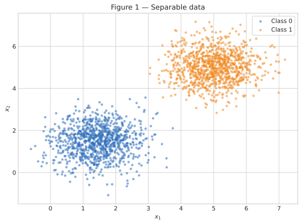
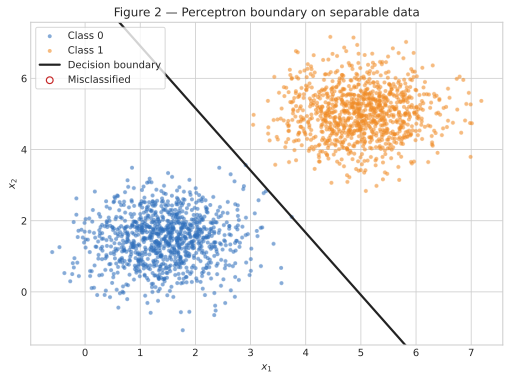
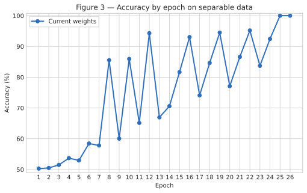
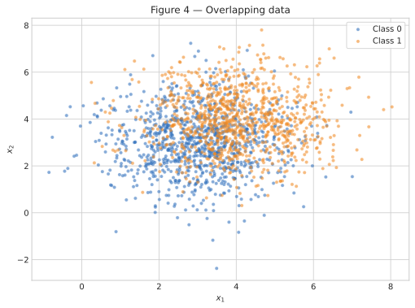
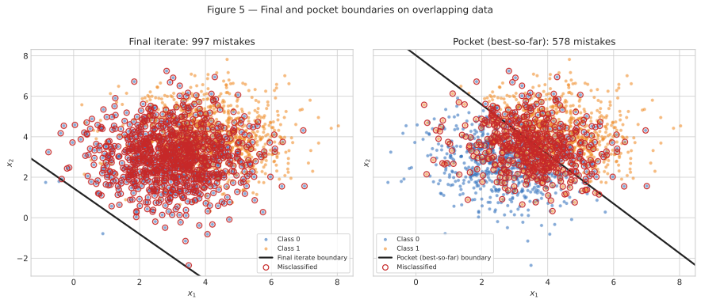
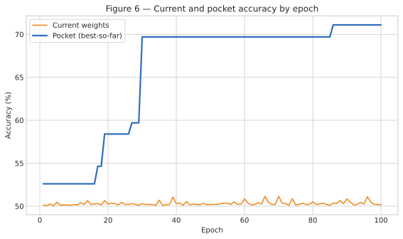

# 2. Perceptron

Este relatório compara o comportamento do mesmo perceptron em dois cenários: dados
linearmente separáveis e dados com forte sobreposição. O classificador foi implementado
do zero com NumPy; nenhuma implementação pronta de modelo foi utilizada. A única fonte de
aleatoriedade do relatório é `rng = np.random.default_rng(42)`, mantida durante todos os
experimentos.

## Exercise 1

### A — Generate the data

Foram geradas 1.000 observações de cada classe. Para a Classe 0, usei média
$[1{,}5, 1{,}5]$; para a Classe 1, média $[5, 5]$. As duas classes usam a matriz de
covariância

$$
\begin{bmatrix}
0{,}5 & 0 \\
0 & 0{,}5
\end{bmatrix}.
$$

Assim, o conjunto tem 2.000 pontos bidimensionais. A Figura 1 mostra duas nuvens bem
afastadas em relação à dispersão dentro de cada classe.


/// caption
**Figura 1** — Dados do Exercício 1: 1.000 pontos por classe, com as médias e a
covariância especificadas no enunciado.
///

### B — Implement the perceptron

O perceptron calcula o escore $z=\mathbf{w}^{\top}\mathbf{x}+b$ e prevê 1 quando
$z\geq 0$ e 0 caso contrário. Para cada erro, os parâmetros são atualizados por

$$
\mathbf{w}\leftarrow\mathbf{w}+\eta(y-\hat y)\mathbf{x},\qquad
b\leftarrow b+\eta(y-\hat y).
$$

Usei $\eta=0{,}01$, $b=0$ e pesos iniciais não nulos sorteados de
$\mathcal{N}(0,0{,}01^2)$: $\mathbf{w}_0=[0{,}002532,\ 0{,}008952]$. O treinamento
percorre as observações sempre na mesma ordem e termina após uma época completa sem
atualizações ou ao atingir 100 épocas. A acurácia no conjunto completo é registrada ao
fim de cada época.

O arquivo abaixo contém a geração dos dados, a classe `Perceptron`, o treinamento e a
produção das seis figuras.

``` { .python .copy .select linenums='1' title="docs/exercises/perceptron/code/perceptron.py" }
--8<-- "docs/exercises/perceptron/code/perceptron.py"
```

### C — Train and measure

Com $\eta=0{,}01$, o treinamento terminou em **26 épocas**, incluindo a última passagem
sem atualização. Os parâmetros finais foram

$$
\mathbf{w}=[0{,}050497,\ 0{,}028872],\qquad b=-0{,}250000,
$$

e a acurácia final foi **100,00%**. A Figura 2 mostra que a fronteira separa as duas
nuvens e que não existem pontos classificados incorretamente.


/// caption
**Figura 2** — Fronteira de decisão final para $\eta=0{,}01$. Pontos incorretos seriam
marcados por círculos vermelhos; não há nenhum neste caso.
///


/// caption
**Figura 3** — Acurácia do perceptron ao final de cada época no conjunto separável.
///

### D — Analysis

**1. Por que ocorre convergência?** Como existe uma reta capaz de separar as classes,
cada erro aciona uma correção na direção $\eta(y-\hat y)\mathbf{x}$. À medida que a
fronteira entra na região de separação, menos observações acionam a regra. Neste
experimento ocorreram 73 atualizações no total; nas últimas épocas com erro houve apenas
3, 2, 3 e 1 atualizações, seguidas de 0 na época 26. Uma época completa sem correção
confirma que todos os 2.000 pontos estão do lado correto.

**2. Efeito de $\eta=1{,}0$.** Mantendo os dados e exatamente os mesmos pesos iniciais,
o novo treinamento também atingiu **100,00%**, agora em **37 épocas**, com
$\mathbf{w}=[5{,}870616,\ 3{,}359239]$ e $b=-31{,}000000$. As direções normalizadas
foram

$$
\frac{\mathbf{w}_{0{,}01}}{\lVert\mathbf{w}_{0{,}01}\rVert}
=[0{,}868123,\ 0{,}496349],\qquad
\frac{\mathbf{w}_{1{,}0}}{\lVert\mathbf{w}_{1{,}0}\rVert}
=[0{,}867950,\ 0{,}496652].
$$

As direções ficaram muito próximas, mas não idênticas. Além disso, o viés normalizado
$b/\lVert\mathbf{w}\rVert$ mudou de $-4{,}297888$ para $-4{,}583241$; portanto, as
retas também têm posições diferentes. O learning rate controla o tamanho de cada salto.
Com pesos iniciais da ordem de $0{,}01$, uma atualização com $\eta=1$ domina quase
completamente a inicialização, enquanto uma atualização com $\eta=0{,}01$ tem escala
comparável a ela. Como há várias fronteiras que separam estes dados, saltos diferentes
podem terminar em separadores diferentes sem mudar a acurácia final.

**3. O que mudaria com inicialização nula?** Considere duas taxas positivas $\eta_1$ e
$\eta_2$ e inicialização $(\mathbf{w}^{(0)},b^{(0)})=(\mathbf{0},0)$. Defina
$c=\eta_2/\eta_1$. Antes de qualquer atualização,
$(\mathbf{w}^{(0)}_2,b^{(0)}_2)=c(\mathbf{w}^{(0)}_1,b^{(0)}_1)$. Se essa relação vale
em uma etapa, os escores do segundo treinamento são $c$ vezes os do primeiro. Como
$c>0$, ambos geram a mesma previsão e cometem erros nas mesmas observações. Depois da
atualização,

$$
\begin{aligned}
\mathbf{w}^{(t+1)}_2
&=c\mathbf{w}^{(t)}_1+\eta_2(y-\hat y)\mathbf{x}\\
&=c\left[\mathbf{w}^{(t)}_1+\eta_1(y-\hat y)\mathbf{x}\right]
=c\mathbf{w}^{(t+1)}_1,
\end{aligned}
$$

e o mesmo argumento dá $b^{(t+1)}_2=cb^{(t+1)}_1$. Por indução, os parâmetros ficam
sempre proporcionais. Multiplicar $\mathbf{w}$ e $b$ pelo mesmo número positivo não
muda $\mathbf{w}^{\top}\mathbf{x}+b=0$; por isso, com inicialização totalmente nula, a
fronteira e o número de épocas seriam idênticos para as duas taxas.

## Exercise 2

### A — Generate the data

O mesmo gerador aleatório continuou a partir do Exercício 1. Foram produzidas mais 1.000
observações por classe, agora com médias $[3,3]$ e $[4,4]$ e covariância comum

$$
\begin{bmatrix}
1{,}5 & 0 \\
0 & 1{,}5
\end{bmatrix}.
$$

A menor distância entre as médias e a maior variância provocam a forte sobreposição
visível na Figura 4.


/// caption
**Figura 4** — Dados do Exercício 2: as classes se sobrepõem e não podem ser separadas
perfeitamente por uma reta.
///

### B — Train, keeping the best weights

Reutilizei a mesma classe, com $\eta=0{,}01$ e limite de 100 épocas. A única adição foi o
*pocket*: após cada atualização causada por um erro, a acurácia no conjunto completo é
calculada. Quando ela supera estritamente a melhor já observada, uma cópia dos parâmetros
é preservada.

Após a época 100, os parâmetros da iteração final foram

$$
\mathbf{w}_{final}=[0{,}054484,\ 0{,}048043],\qquad
b_{final}=-0{,}070000,
$$

com acurácia de **50,15%**. O melhor estado do pocket ocorreu na **época 86**:

$$
\mathbf{w}_{pocket}=[0{,}010664,\ 0{,}008727],\qquad
b_{pocket}=-0{,}070000,
$$

com acurácia de **71,10%**. A diferença de 20,95 pontos percentuais mostra por que os
últimos parâmetros não representam necessariamente os melhores parâmetros quando os
dados não são separáveis.

### C — Figures


/// caption
**Figura 5** — Fronteira da última iteração (à esquerda) e do pocket (à direita). Os
círculos vermelhos identificam os pontos classificados incorretamente em cada painel.
///


/// caption
**Figura 6** — A acurácia dos pesos correntes oscila, enquanto a curva do pocket só pode
permanecer constante ou subir.
///

### D — Analysis

**1. Por que há diferença entre o estado final e o pocket?** A fronteira final ficou a
apenas $|b|/\lVert\mathbf{w}\rVert=0{,}964$ unidade da origem, muito abaixo da nuvem de
dados. Por isso ela prevê Classe 1 para quase todos os pontos e obtém 50,15%, resultado
próximo ao de um palpite constante em um conjunto balanceado. A fronteira do pocket fica
a 5,080 unidades da origem e atravessa a região entre os centros, alcançando 71,10%.

Isso decorre diretamente da atualização. Em cada erro, $b$ muda apenas $0{,}01$, enquanto
$\mathbf{w}$ muda por $0{,}01\mathbf{x}$; como $\lVert\mathbf{x}\rVert\approx5$, a
alteração típica no vetor de pesos tem norma próxima de $0{,}05$. Além disso, os dados
estão organizados com a Classe 0 antes da Classe 1. Dentro de uma época, os últimos erros
da Classe 1 podem empurrar a fronteira para uma posição ruim pouco antes do treinamento
ser interrompido pelo limite de épocas. O pocket não depende dessa última posição: ele
guarda a melhor fronteira visitada durante toda a trajetória.

**2. Comparação com a convergência do Exercício 1.** Na Figura 3, a acurácia chega a 100%
e permanece lá; uma época sem atualizações encerra o treinamento. Na Figura 6, a
acurácia corrente continua oscilando (nas 100 épocas, ficou entre 50,05% e 51,15% ao fim
de cada passagem), embora o pocket permaneça em 71,10%. O teorema de convergência do
perceptron garante um número finito de erros somente quando existe um hiperplano que
separa perfeitamente as classes com margem positiva. A sobreposição deste conjunto
viola justamente a hipótese de separabilidade linear, pois há pontos das duas classes na
mesma região do plano.

**3. Mais épocas ou menor learning rate resolvem?** Mais épocas apenas prolongam o ciclo
de correções conflitantes: como nenhuma reta classifica todas as observações, sempre
existirá algum ponto que inicia uma nova atualização. Isso pode dar ao pocket mais
oportunidades de encontrar uma reta um pouco melhor, mas não faz o perceptron padrão
convergir. Reduzir $\eta$ também não elimina a contradição. A regra continua movendo os
parâmetros em direções opostas para exemplos sobrepostos; apenas reduz a escala dos
passos. Como a decisão depende do sinal e $(\mathbf{w},b)$ podem ser reescalados por uma
constante positiva sem alterar a fronteira, uma taxa menor não cria o separador que os
dados não possuem.

## Results summary

| # | Quantity | Value |
|---|----------|-------|
| 1 | Exercise 1 — final $\mathbf{w}$ and $b$ | $\mathbf{w}=[0{,}050497,\ 0{,}028872]$; $b=-0{,}250000$ |
| 2 | Exercise 1 — epochs to convergence | 26 |
| 3 | Exercise 1 — final accuracy | 100,00% |
| 4 | Exercise 1 — epochs and final accuracy with $\eta=1{,}0$ | 37 epochs; 100,00% |
| 5 | Exercise 2 — final $\mathbf{w}$ and $b$ | $\mathbf{w}=[0{,}054484,\ 0{,}048043]$; $b=-0{,}070000$ |
| 6 | Exercise 2 — accuracy of the final weights | 50,15% |
| 7 | Exercise 2 — accuracy of the pocket weights | 71,10% |
| 8 | Exercise 2 — epoch at which the pocket best occurred | 86 |
